# Beau Belle | Nail Salon

## Welsh Nail Salon | Situated in Newport Wales
[![Forks][forks-shield]][forks-url]
[![Issues][issues-shield]][issues-url]
[![LinkedIn][linkedin-shield]][linkedin-url]

<a href="https://nccadman19.github.io/beau-belle/" rel="nofollow" target="_blank">Visit the website here</a>

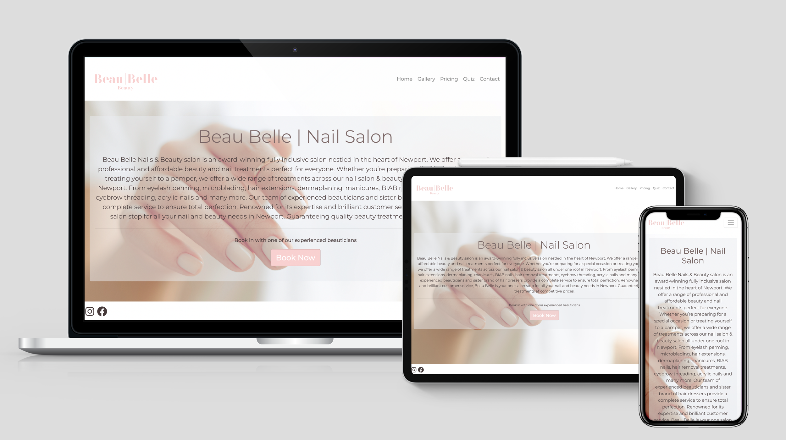

This website is made up of the following sections:

### Home

1. Navbar with logo, name of nail salon and nav bar links to other pages
2. A paragraph about the nail salon
3. Footer with copyright and social media links

### Gallery

1. A gallery of images of previous nail art completed by the beau belle salon
2. This page will give inspiration images to people wanting to get their nails done

### Pricing 

1. A pdf document with a breakdown on pricing for the nail services provided by beau belle

### Quiz 

There are so many different types of gel treatments in the world of beauty that can be confusing to customers who are not experienced. This quiz aims to find the best treatment for them in a fun way. 

1. A page where users can complete a quiz to see what treament would be best suited to them 
2. The quiz will return treatment options to the user 
3. The page will then let them retake the quiz or link to the contact option for them to either call, email or use the contact form to contact the salon

### Contact

1. A contact form for people to contact the salon to query any of the services 
2. A place where people can request to book with the salon if they don't want to call and book an appointment 
3. The contact number and email of the salon will also be available here for customers to book an appointment

My business goals for this website are:

1. To attract customers to book an appointment at the salon
2. To give customers inspiration on nail art designs through the gallery page
3. To help customers decide what treatment is best for them 
4. To give them the contact information of the salon

The user goals of this website are:

1. To be able to learn more about the salon
2. To view the pricing of the treaments 
3. To get help with what treament service they would like if they are unsure with the gallery page and the quiz
4. To contact the salon through various channels once they have decided what treatment option they would like 

## Built With 

* Bootstrap
* JQuery
* EmailJS
* Favicon
* Google Fonts

# UX

## Strategy
--------------

Considering the core UX principles I first started to think about the strategy for this website and defined who the target users would be and what features/technologies they would want.

Beau Belle target users are:

Aged 20-60 primarily women 

What these users would be looking for:

Clear, concise, easy-to-read information on the pricing 

Great photos of treatments that show off the beauticians work 

Help with what treatments are better for them

Somewhere to contact us

## Skeleton
--------------

Wireframes

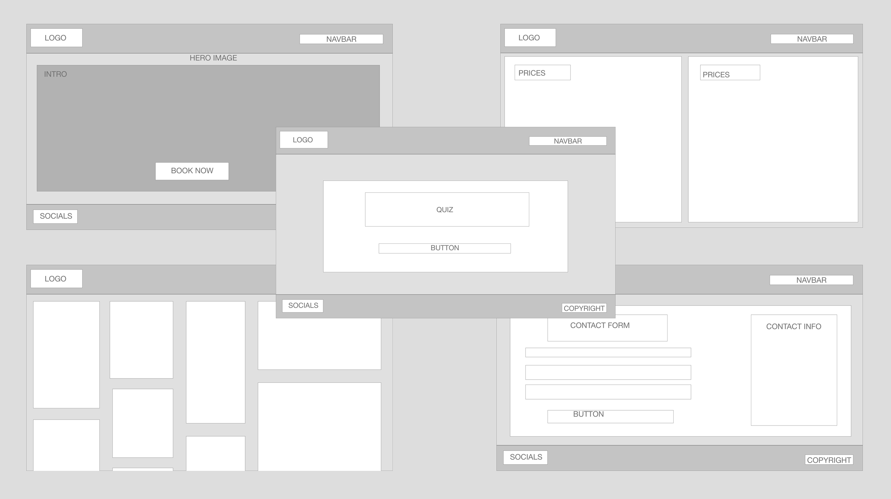
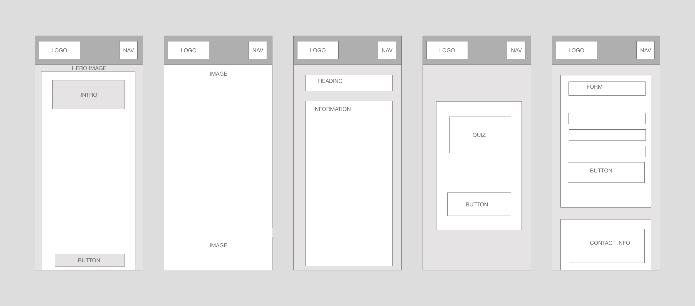

## Surface
--------------

I chose a colour palette based around the logo colours, I put the image into a search engine and copied the colour of the lofo. I wanted this to be reflected on the website. I paired these colours with a dark grey and black font to stand out around the base colour. 

### Colormind

Using the colormind palette on the Beau Belle Logo I selected the colours from this palette and also darker and lighter shades of these colours to create a better contrast.

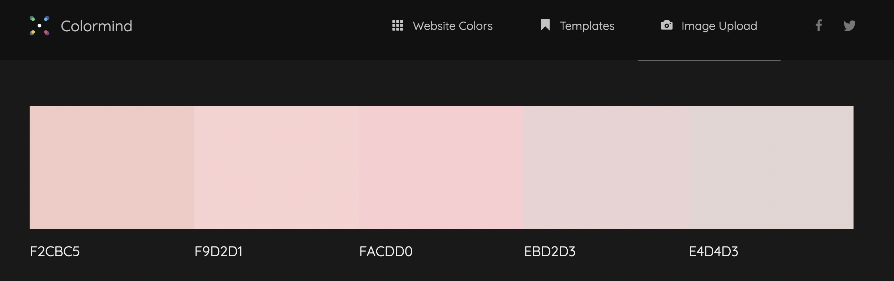

I used Google fonts 'Montserrat', I felt 'Montserrat' was very easy to read and looks professional.

## Features
--------------

This is a fully responsive website that was designed mobile-first as this is the most likely way it will be viewed; the website is divided into the five pages listed in the navbar. All of the headings use the font Montserrat and the body too, this consistency has been used across the website to create a coherent design. 

## Navbar & Footer

The navbar is comprised of a logo and navigation links to the other pages on the site. You can see how the navbar turns into a toggled dropdown menu when viewed on mobile. 

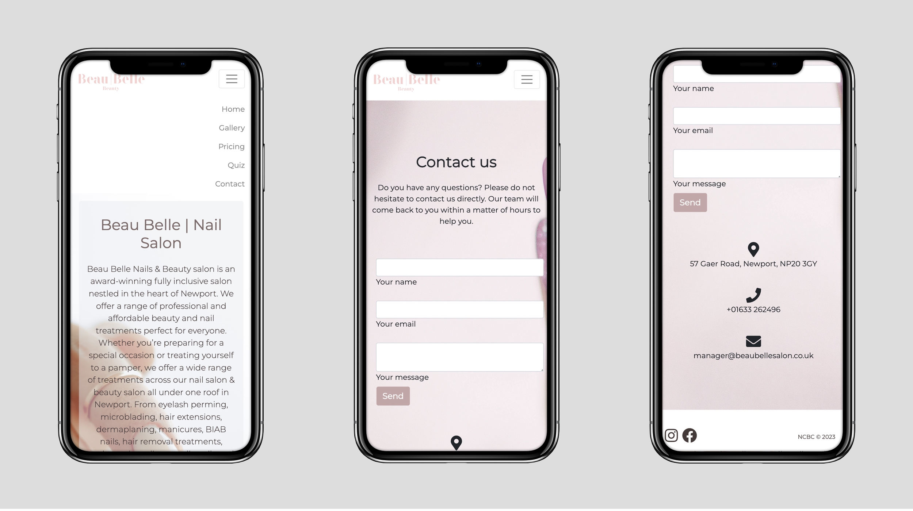

## Home

The home page is made with warm and calm colours to entice customers to the website and show the calming feminine energy of the studio. It gives an overview of the salon and gives you the option to go straight to the contact page if you know what treatment you are looking to book.

## Gallery

This is a gallery page of the work the beauticians have completed at the Beau Belle salon. It shows customers the quality of work provided and gives them inspiration for looks they may want to try out. 

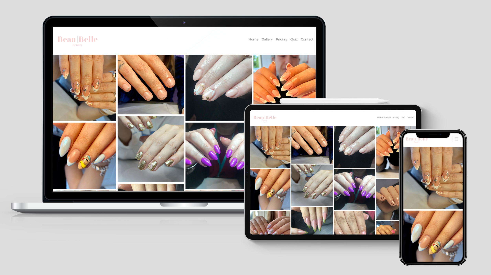

## Pricing 

This page displays all of the treatment options available at the beau belle salon and their prices.

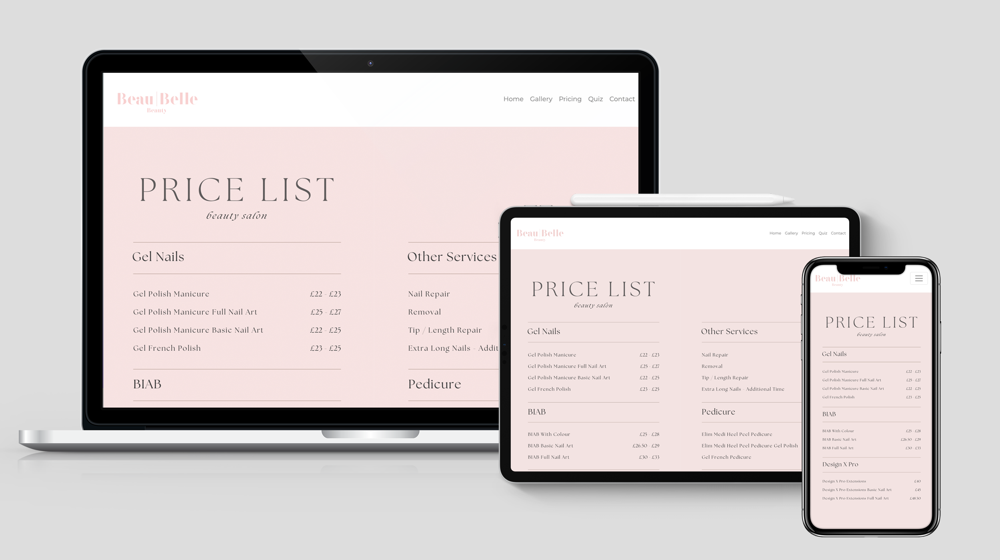

## Quiz 

This page is an interactive quiz for users who are unsure on what treatment they require at Beau Belle salon. There are so many different types of gel treatments in the world of beauty that it can be confusing to customers who are not experienced in the beauty world. This quiz aims to find the best treatment for them in a fun way. 

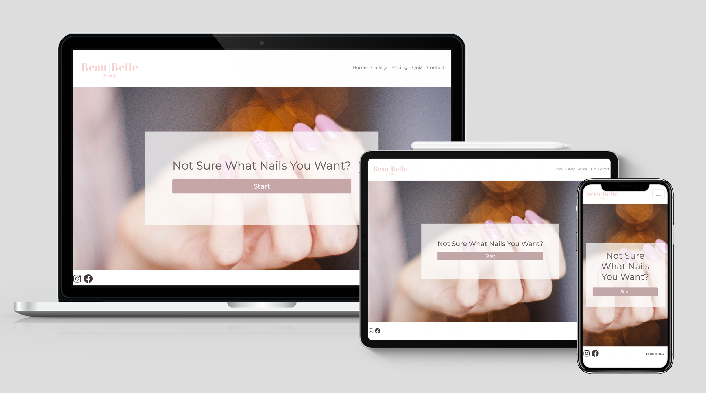

### Quiz Layout

The quiz is compromised over several possible outcomes to ensure you book the correct treatment for your nails. 

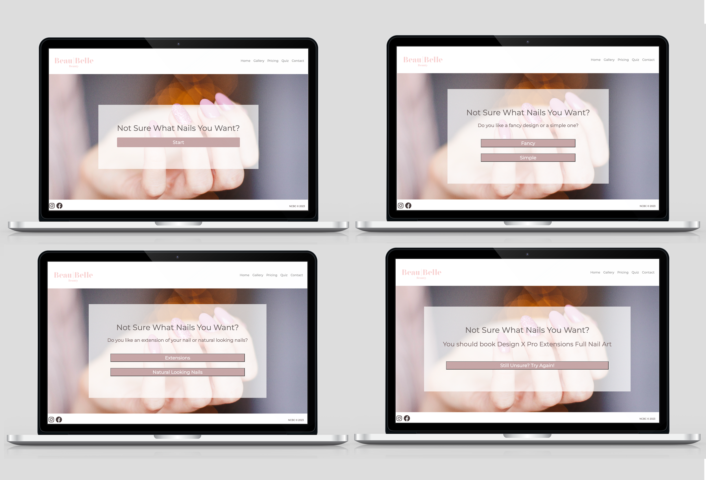

## Contact Us

This is a contact page for people to contact us regarding further information or booking a treatment with the salon. 

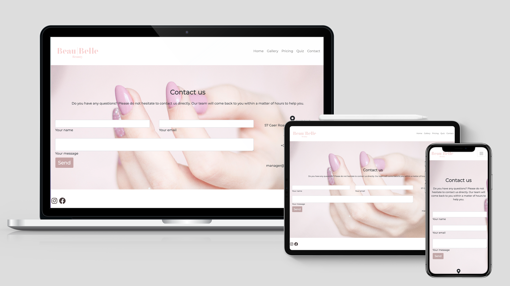

### Media

Hero image - is designed in calm and feminine colours to create a warm welcome to customers 

Galley - contains good quality clear images of a selection of nail art that was created by the beauticians at Beau Belle Salon 

Pricing - contains 2 images that comprise of the pricing for nails and feet at the salon

Quiz - contains 1 clear image of nail art

Contact section - contains a faded image to ensure clear visability of the contact information. I decided on this background to not distract customers from making a booking query 

## Functionality Testing 
------------
### Responsiveness 

These tests have been completed on mobile and desktop. 

| Page | Test | Result |
| --------------- | --------------- | --------------- |
| Website | Navbar | No Issues |
| Website | Footer | No Issues |
| Website | Logo Link to Homepage | No Issues |
| Website | Menu Collapses on Smaller Screen | No Issues |
| Website | Spelling & Viewing | No Issues |
| Index | Page Responsiveness | No Issues |
| Index | Navigation Links Correctly | No Issues |
| Gallery | Page Responsiveness | No Issues |
| Gallery | Image Grid Responsiveness | No Issues |
| Pricing | Image Grid Responsiveness | No Issues |
| Quiz | Page Responsiveness | No Issues |
| Quiz | Quiz Functions on One Runthrough | No Issues |
| Quiz | Quiz Functions on Subsequent Runthrough | Current Bug |
| Contact | Page Responsiveness | No Issues |
| Contact | Contact Form Submits | No Issues |
| Contact | Contact Form Clears | No Issues |
| Contact | Data Returns | No Issues |

### Testing

I did not add alt tags to the gallery page and this caused a few errors that were easily fixed. This allowed me to incrementally improve my code and upon completion, there were 0 errors found.

| Page | Test | Result |
| --------------- | --------------- | --------------- |
| Index| Validator HTML | 0 Errors |
| Index | Validator CSS | 0 Errors |
| Gallery | Validator HTML | 0 Errors |
| Gallery | Validator CSS | 0 Errors |
| Pricing | Validator HTML| 0 Errors |
| Pricing | Validator CSS | 0 Errors |
| Quiz | Validator HTML | 0 Errors |
| Quiz | Validator CSS | 0 Errors |
| Quiz | JSLint | 0 Errors |
| Contact | Validator HTML| 0 Errors |
| Contact | Validator CSS | 0 Errors |
| Contact | JSHint | 2 Errors |
------------
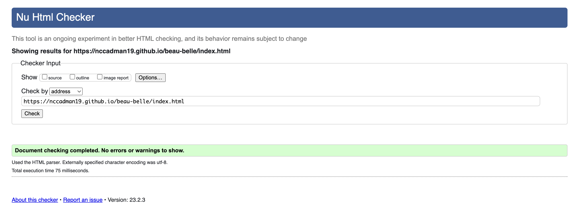
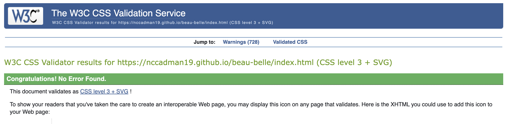
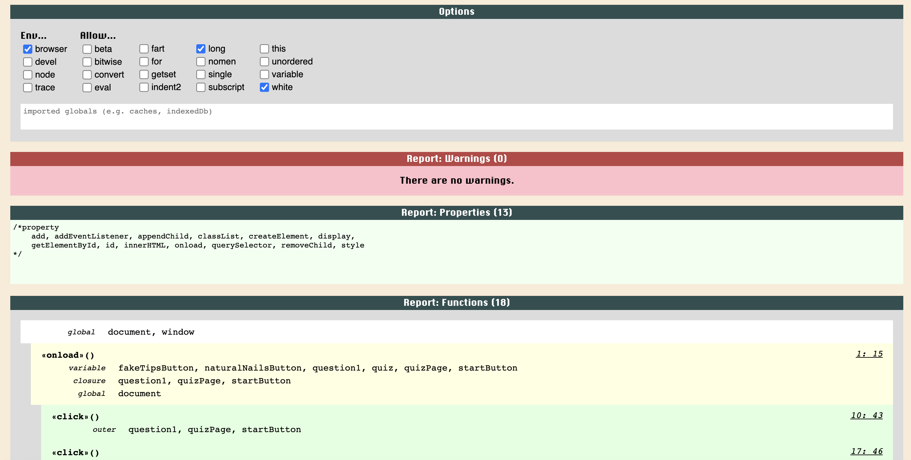
 

### Compatibility Testing 

The website was tested on the following browsers:

* Google Chrome
* Safari 
* Microsoft Egde

The site worked well across all browsers and discrepancies were not found.

The website was tested on the following devices:
* iPhone SE
* iPhone XR
* iPhone 12 Pro
* Pixel 5
* Samsung Galaxy S8+
* Samsung Galaxy S20 Ultra
* iPad Air
* iPad Mini
* Surface Pro 7
* Surface Duo
* Galaxy Fold
* Samsung Galaxy A51
* Nest Hub
* Nest Hub Max

### Resolved Bugs 

| Issue | Fix | 
| --------------- | --------------- | 
| Alt Tags not added to the gallery page | This error was easilt fixed by adding alt tags | 
| Spacing errors in code | Removed the checks of spacing between characters as unnecessary | 
| Var errors | Replaced var errors with let which corrected this error | 
| Missing ; | ; added to places where it was supposed to be | 
| iPad Air incompatibility | Expanded the hero images on pages that contained them to rectify this with a media query | 
| Buttons on quiz had no feedback | Added the same transition as the start button to subsequent questions | 

### Unresolved Bugs

2 errors in the contact section on JSLint as follows:

* One undefined variable: Line 15	emailjs
* One unused variable: Line 1	sendMail

These are both being used in the contact.html but are not visible in this javascript code. 

## Usability Testing 
------------

### Navigation 

I tested the navigation with the test subject being a user who wants to book in a nail treatment with Beau Belle Salon for the first time but is unsure what to book. 

On opening the website there is initial information on the salon with a clear button that takes you to the booking page if you were confident in the treatment you wanted to book. 

The gallery page shows the skills of the nail artist at the salon clearly, it is responsive to mobile and desktop. 

The pricing page has a very clear layout of the treatment options available.

The quiz page functions well on mobile and desktop, it helps users by allowing them to select options they prefer and provided the perfect treatment option for them. 

The contact page is clear in the navbar, you can click and get in contact with the team. Either by using the contact information provided or using the contact form that currently redirects to my email address. 

### Accessibility

Accessibility tested using Lighthouse (Google Chrome Developer Tool)

#### Index Page
Desktop          |  Mobile
:-------------------------:|:-------------------------:
  |  

#### Gallery Page
Desktop          |  Mobile
:-------------------------:|:-------------------------:
  |  

#### Pricing Page
Desktop          |  Mobile
:-------------------------:|:-------------------------:
  |  

#### Quiz Page
Desktop          |  Mobile
:-------------------------:|:-------------------------:
  |  

#### Contact Page
Desktop          |  Mobile
:-------------------------:|:-------------------------:
  |  

# Credits 

Gallery Help 
https://www.w3schools.com/howto/howto_css_image_grid_responsive.asp

EmailJs
https://www.youtube.com/watch?v=5EZsRnJpUNU

Favicon Issue
https://stackoverflow.com/questions/1321878/how-to-prevent-favicon-ico-requests?noredirect=1&lq=1

Event Listener Quiz 
https://stackoverflow.com/questions/27336182/javascript-event-listener-quiz

Event Listener Error
https://stackoverflow.com/questions/26107125/cannot-read-property-addeventlistener-of-null

Base Point of Quiz
https://stackoverflow.com/questions/27336182/javascript-event-listener-quiz

README accessibility & table used as a template
https://github.com/FlashDrag/barber-shop/blob/master/documentation/TESTING.md 

README template
https://github.com/othneildrew/Best-README-Template

## Contact

Please feel free to contact me at nicolecadman@icloud.com

<!-- Links & Images --->

[forks-shield]: https://img.shields.io/github/forks/othneildrew/Best-README-Template.svg?style=for-the-badge
[forks-url]: https://github.com/nccadman19/beau-belle/pulse
[issues-shield]: https://img.shields.io/github/issues/othneildrew/Best-README-Template.svg?style=for-the-badge
[issues-url]: https://github.com/nccadman19/beau-belle/issues
[linkedin-shield]: https://img.shields.io/badge/-LinkedIn-black.svg?style=for-the-badge&logo=linkedin&colorB=555
[linkedin-url]: https://uk.linkedin.com/in/nicole-cadman-69a606230